# 当日BiliBiliTop100视频数据采集与分析

[^MAINTAINER]: nanami016 <983921012@qq.com> <c15959018862@gmail.com>

[TOC]

## 一、选题背景

[目标网址]: https://www.bilibili.com/v/popular/rank/all	"哔哩哔哩排行榜"

抓取字段：(当前)

- 视频排名
- 视频名
- 综合得分
- 播放量
- Up主
- 视频链接 ( URL ) 

意义：

1. 获取当前火热视频
2. 分析视频综合得分与排行榜排名的关系
3. 分析视频综合得分与观看量的关系
4. 观察和统计不同时间点视频榜单的变化

> **历代版本更迭示意图**

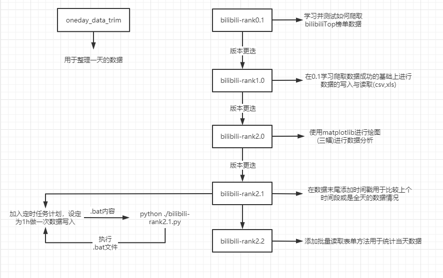

## 二、数据抓取与分析——实现流程

#### 引用必要库

```python
import requests
from bs4 import BeautifulSoup
import csv
import datetime
import xlwt
from xlwt.Workbook import Workbook
import numpy as np 
from matplotlib import pyplot as plt 
import xlrd 
from xlrd import sheet
```

#### 定义静态数据

```python
url = "https://www.bilibili.com/v/popular/rank/all"
h = {"User-Agent": 'Mozilla/5.0 (Windows NT 10.0; Win64; x64)'
     'AppleWebKit/537.36 (KHTML, like Gecko)'
     'Chrome/87.0.4280.66 Safari/537.36'
     }
r = requests.get(url, headers=h, timeout=30)
soup = BeautifulSoup(r.text, 'html.parser')
# 创建空列表用于存放爬取的数据
videos = []
# strftime 格式化输出
# time_now 获取当前时间-精确到分钟
time_now = datetime.datetime.now().strftime('%Y%m%d-%H%M')
# f 嵌入变量
file_name_csv = f'data_save\\top100-{time_now}.csv'
file_name_xls = f'data_save\\top100-{time_now}.xls'
```

#### 创建类——用于存放和返回爬取信息

```python
class Video:
    # 爬取信息
    def __init__(self, rank, title, score, visit, up, url,datetime):
        self.rank = rank		# 视频当前排名
        self.title = title		# 视频名
        self.score = score		# 综合得分
        self.visit = visit		# 观看量
        self.up = up			# up主
        self.url = url			# 视频链接
        self.datetime=datetime	# 当前的时间

    # 使用静态方法直接返回数据 用作写入数据的标题，与上面的公有方法并无关系
    def title_save():
        return ['排名', '标题', '分数', '播放量', 'Up主', 'URL','时间']

    # 返回数据函数 用于之后的 csv 写入函数
    def savedata(self):
        return [self.rank, self.title, self.score, self.visit, self.up, self.url,self.datetime]
```

#### 爬取页面写 html

```python
# 写入方法
def write(file_name, content_str):
    with open(file_name, 'a', encoding='UTF-8') as f:
        f.write(content_str)
        f.close
```

### 1、将爬取的信息存入列表

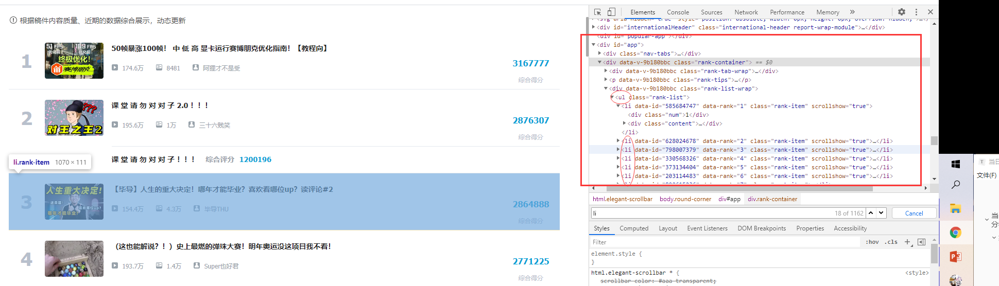

> **排名——解析规则**

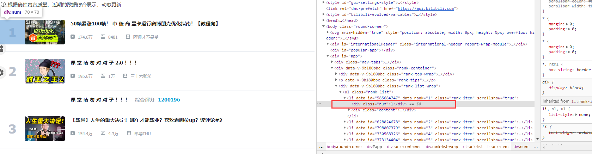

> **综合得分——解析规则**

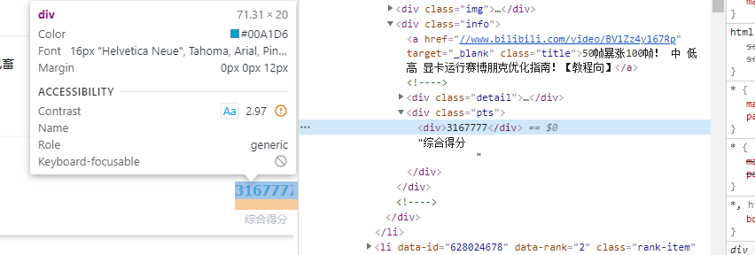

> **标题——解析规则**

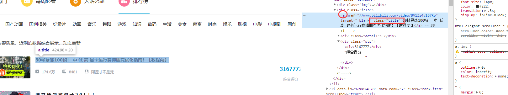

> **播放量——解析规则**

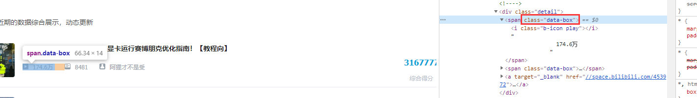

> **up名——解析规则**

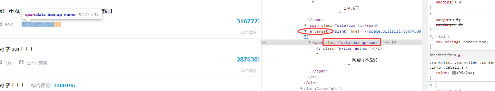

> **URL——解析规则**

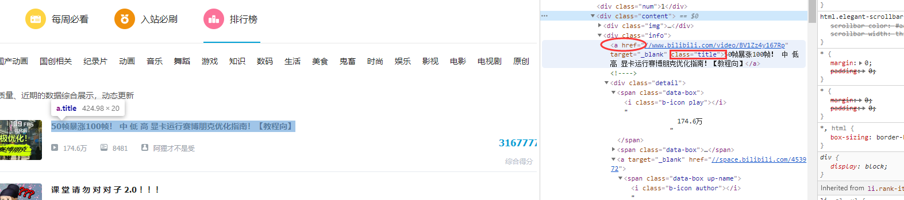

```python
# 可知，我们要爬取的每个视频信息其实是 h5 源码下块元素 div 下无序列表 ul 下的多个 li 中的内容

def appendData(videos):
    # 1、找到所有属于 rank-item 类的 li（列表）
    items = soup.findAll('li', {'class': 'rank-item'})
    
    # 2、在所有的 li 中用 Beautifulsoup 的 find 方法进行关键字遍历查找
    for itm in items:
        
        title = itm.find('a', {'class': 'title'}).text              # 标题
        score = itm.find('div', {'class': 'pts'}).text              # 综合得分
        rank = itm.find('div', {'class': 'num'}).text               # 排名
        visit = itm.find('span', {'class': 'data-box'}).text        # 播放量
        up = itm.find_all('a',)[2].text                             # up
        url = itm.find('a', {'class': 'title'}).get('href')         # 获取链接

        # 3、调用 Video 类方法来存放数据到 v
        # 格式化写入
        v = Video(rank, title, score.strip('\n'), visit.strip('\n').strip(), up.strip('\n').strip(), url.strip('//'),time_now)
        # 4、将每次爬取的数据一个个添加到 videos 列表
        videos.append(v)
```

### 2、将数据导出至 xls，csv

```python
# 写入 csv
def writeTocsv(file_name_csv):
    # 打开文件 ‘w’ 写入
    with open(file_name_csv, 'w', newline='') as f:
        writer = csv.writer(f)

        # 存放列表——writerow()——第一行保存标题
        writer.writerow(Video.title_save())

        # 按行写入
        for v in videos:
            writer.writerow(v.savedata())
            
# 写入 xls
def writeToxls(file_name_xls,videos):
    # 表头赋值
    head=Video.title_save()
    work_book=xlwt.Workbook(encoding='UTF-8')
    # 创建工作簿并命名
    sheet = work_book.add_sheet(sheetname='BiliBili-TOP100-NOW')
    data_list=[]
    # 先写表头
    for i in range(len(head)):
        sheet.write(0,i,head[i])
    for i in videos:
        data_list.append(i.savedata())
    
   	# 按单元格遍历写入单元格
    for z in range(len(head)):
        for j in range(len(videos)):
            # j+1 跳过第一行(第一行已用于写入标题)
            sheet.write(j+1,z,data_list[j][z])
    # 保存 xls 文件
    work_book.save(file_name_xls)
```

### 3、读取xls数据并绘图

```python
def read_xls_and_plt(file_name):
    # 用于——按排名存放各个视频的播放量
    visit=[]
    work_book = xlrd.open_workbook(file_name)
    sheet_names = work_book.sheet_names()
    sheet_first = work_book.sheet_by_name(sheet_names[0])
    # 对TOP15进行取样分析   
    for i in range(1,16):
        # print(sheet_first.cell_value(i,3))
        # 格式化读取数字
        visit.append(float(sheet_first.cell_value(i,3).strip('万')))
    # 对TOP15进行取样分析
    rank = np.arange(1,16) 
    # 顺位排名与观看量的关系
    plt.title("RANK&VISIT") 
    plt.xlabel("RANK") 
    plt.ylabel("VISIT") 
    plt.bar(rank,visit,align='center') 
    plt.show()
```

### 4、读取xls数据画数据对比图

```python
def plt_compare(file_name):
    # 创建 point_list 用于柱状图显示综合得分
    point_list=[]
    # 创建 point_list2 用于横向柱状图进行左右数据对比
    point_list2=[]
    # 观看量
    visit=[]
    work_book = xlrd.open_workbook(file_name)
    sheet_names = work_book.sheet_names()
    sheet_first = work_book.sheet_by_name(sheet_names[0])
     # 对TOP15进行取样分析   
    for i in range(1,16):
        # print(sheet_first.cell_value(i,3))
        # 格式化读取数字
        visit.append(float(sheet_first.cell_value(i,3).strip('万')))
    for i in range(1,16):
        # print(sheet_first.cell_value(i,3))
        # 格式化读取数字并处理
        point_list.append(float(float(sheet_first.cell_value(i,2).strip().strip('综合得分'))/float(sheet_first.cell_value(i,3).strip('万'))/100.0))
    for i in range(1,16):
        # print(sheet_first.cell_value(i,3))
        # 格式化读取数字并处理
        point_list2.append(-float(float(sheet_first.cell_value(i,2).strip().strip('综合得分'))/float(sheet_first.cell_value(i,3).strip('万'))/100.0))
    # 对TOP15进行取样分析
    rank = np.arange(1,16) 
    # 图1
    plt.figure(1)
    # 顺位排名下 得分与观看量的比值
    plt.title("POINT/VISIT & RANK")
    # 使用红色实线 并 在取样点做⭐标记
    plt.plot(rank, point_list, 'r-*')
    plt.xlabel("RANK")
    plt.ylabel("VISIT")
    # 覆盖绘制柱状图
    plt.bar(rank, visit, align='center')
    plt.show()
    # 图2
    plt.figure(2)
    # 顺位排名下 得分与观看量的比值
    plt.title("POINT/VISIT & RANK")
    plt.xlabel("RANK")
    plt.ylabel("POINT/VISIT")
    # 绘制左横向柱状图
    plt.barh(rank, point_list2)
    plt.title("point/visit & visit")
    plt.xlabel("RANK")
    plt.ylabel("VISIT")
    # 绘制右横向柱状图
    plt.barh(rank, visit)
    # 在图上进行标识
    plt.text(-200, 8, 'p/v')
    plt.text(200, 9, 'visit')
    plt.show()
```

### 5、批量读取csv函数

```python
def oneday_data_trim():
    # 路径根据自己所打开目录进行修改
    path = '课设\作品\data_save'
    files = os.listdir(path)
    csv_list = []
    for f in files:
        # 递归查找 .csv 的文件	在 csv 文件名前 + '\\' 指向该 csv 文件
        if os.path.splitext(f)[1] == '.csv':
            csv_list.append(path + '\\' + f)
        else:
            pass
    # 从第一行开始读取(标题读取)，使用 gbk 编码，csv 不认 utf-8
    df = pd.read_csv(csv_list[0], low_memory=False,encoding='gbk')
    # 从第二行进行数据读取，同样使用 gbk 编码
    for i in range(1, len(csv_list)):
        df_i = pd.read_csv(csv_list[i], low_memory=False,encoding='gbk')
        pieces = [df[:], df_i[:]]
        df = pd.concat(pieces).drop_duplicates()
    # 想保留的列的编号。0为起点
    df = df.iloc[:, [ 1, 2, 4, 6]]  
    # 另存为的 csv 名称
    df.to_csv(path + '\\bilibiliTop_Total.csv', index=None, encoding='gbk')
```

### 6、主函数

```python
# 写爬取的 html 源码，根据自己所在目录进行更改
write('课设\作品\\bilibiliTOP100.html', r.text)
write('课设\作品\\bilibiliTOP100.txt', r.text)
# 爬取数据并添加
appendData(videos)
# 写入 csv
writeTocsv(file_name_csv)
# 写入 xls
writeToxls(file_name_xls, videos)
# 对当前创建的xls文件直接进行数据分析
read_xls_and_plt(file_name_xls)
# 排名比较————分数与观看量的关系
plt_compare(file_name_xls)
```

## 三、展示系统

> **图表展示**

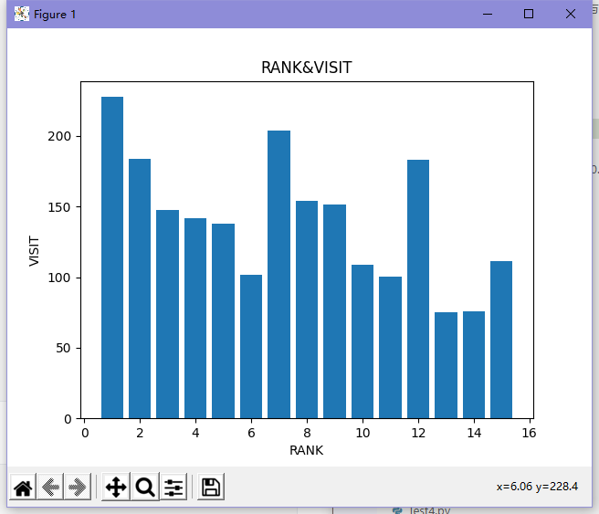

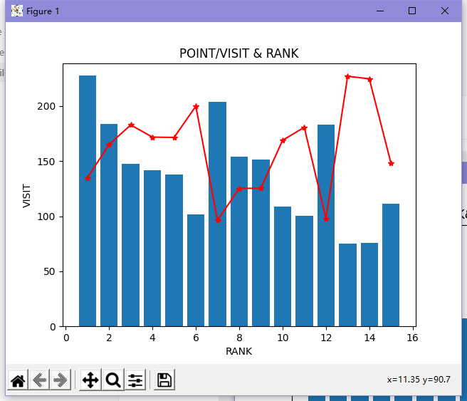

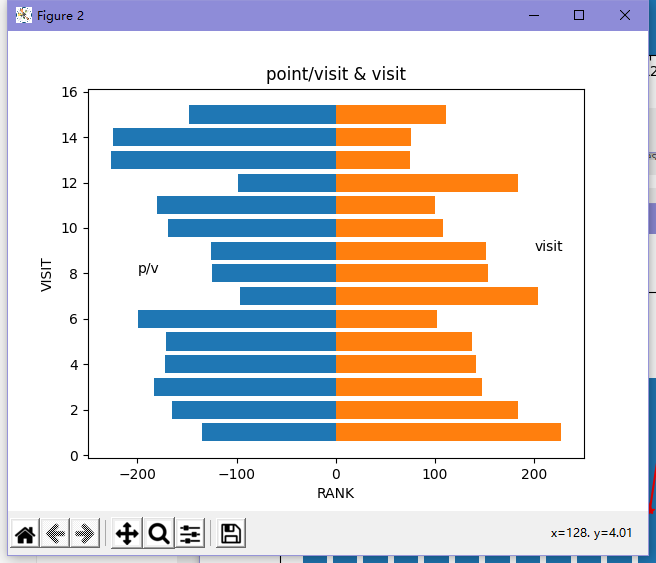

> **计划任务展示**

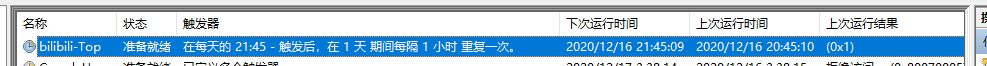

> **数据爬取展示**

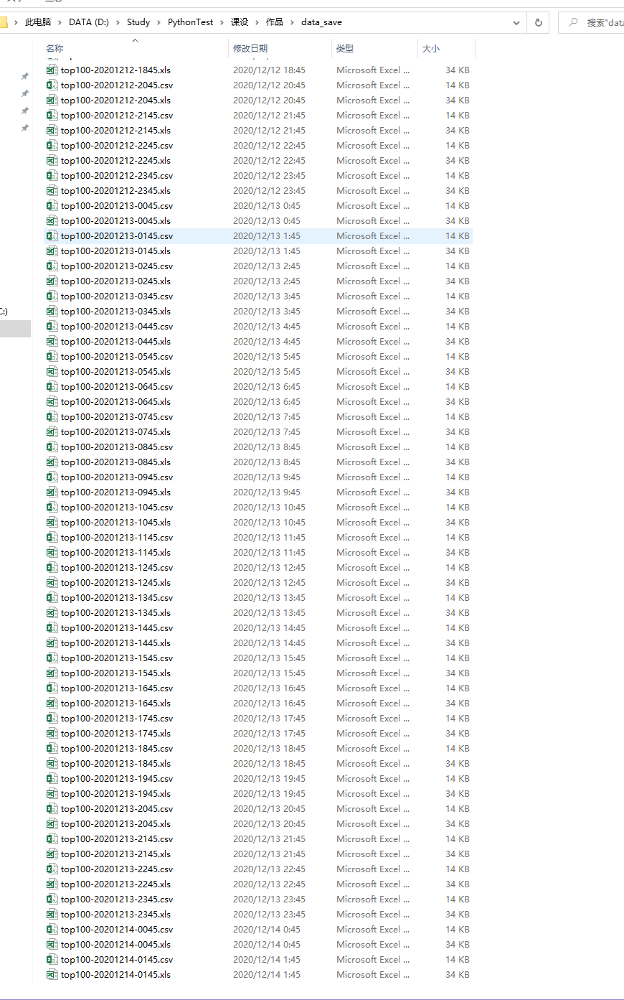

> **单时间节点 csv 展示**

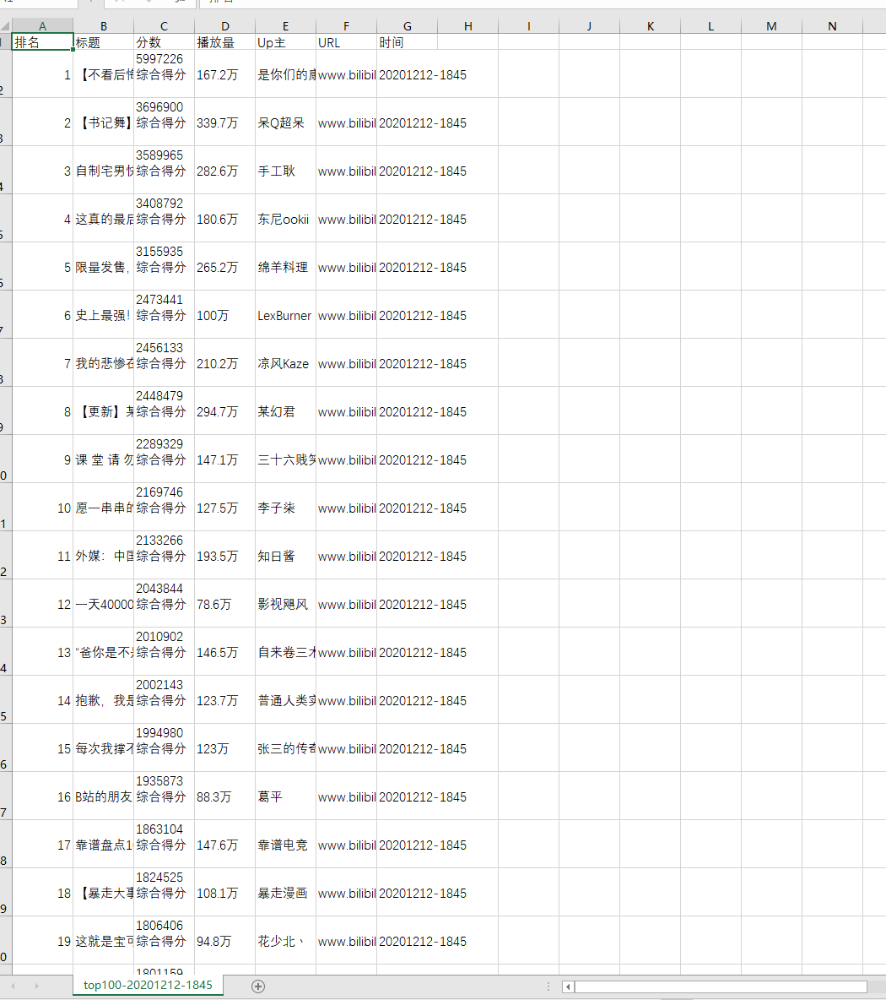

> **单时间节点 xls 展示**

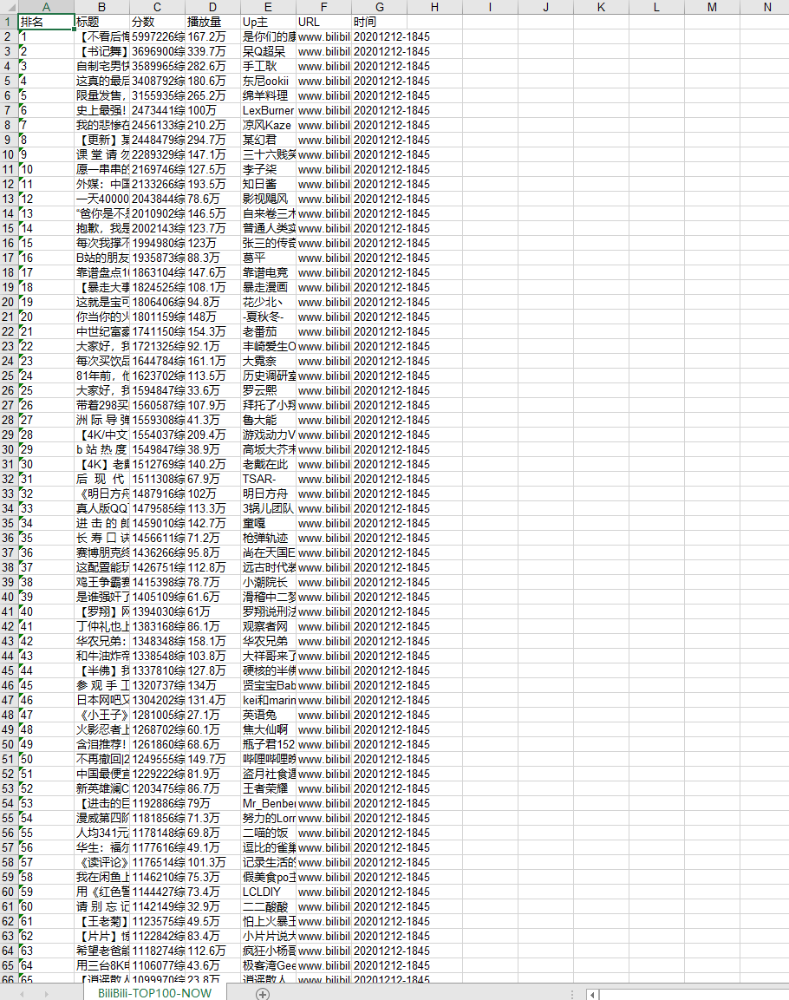

> **数据总和展示(筛选后展示)**

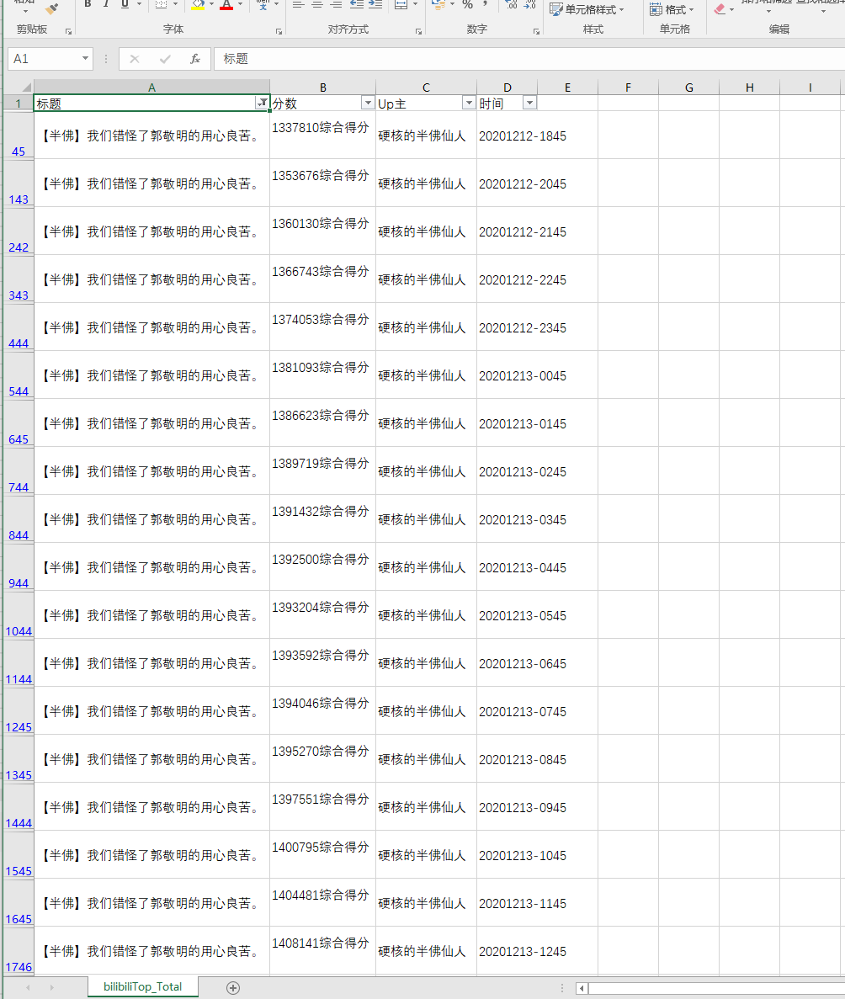

## 四、遇到的核心问题和解决方案

**核心问题**

- 哔哩哔哩排行榜如何爬取数据

- Beautifulsoup 如何使用
- 数据如何保存为 csv，xls
- Matplotlib 库如何使用
- 如何批量读取已保存的 csv 数据

**解决方案**

- 通过对网站的源码分析大致明白网页框架
- 查看 beautifulsoup 官方使用文档并搜索相关资料
- 查阅网上已有写入csv与xls的文字、视频教程进行初步学习
- 查看 Matplotlib 官方文档教程，横向柱状图则查阅网络资料自行调试
- 查询网络教程按需修改源码

> **练习用——文件夹**

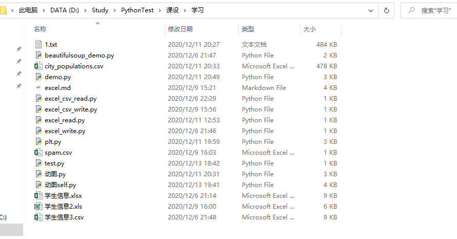

> **用于进行每一次更改并调试的 demo 文件**

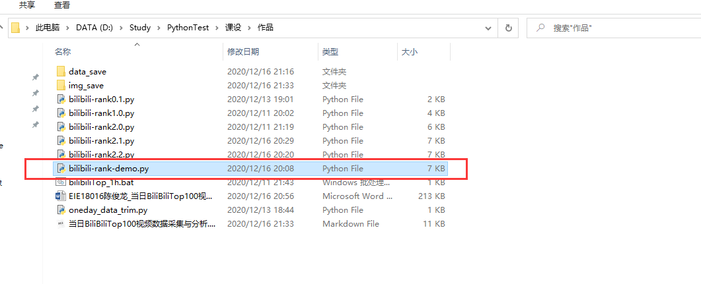

## 五、个人收获与反思

**收获**

1. 通过这门课程的学习，我更加系统的深入了解了python语言的各种方法，在原有的一定基础上得到了提高和锻炼。
2. 第一次接触了python最常用的爬虫功能和各种库的使用。
3. 将以前很多重复性以及机械化的操作通过代码来实现，解放劳动力

**反思**

1. 此次数据分析做的并不完善，不能直观的反映出综合得分与观看量的必然关系
2. 对于python的了解也仅仅停留在语法和基础库的表面，并没能很好的多次实践，熟练运用大量的库

------

[引用]: https://www.bilibili.com/video/BV1j4411c7ny	"半个小时教会你使用requests和beautifulsoup爬取网页数据（爬虫入门）"
[引用]: https://www.bilibili.com/video/BV1KC4y1t7uG?p=2&amp;t=342	"Python处理Excel数据，就是这么简单粗暴！"
[引用]: https://www.cnblogs.com/insane-Mr-Li/p/9092619.html	"python里面的xlrd模块详解（一）"
[引用]: https://cloud.tencent.com/developer/article/1591271	"利用Python批量合并csv"
